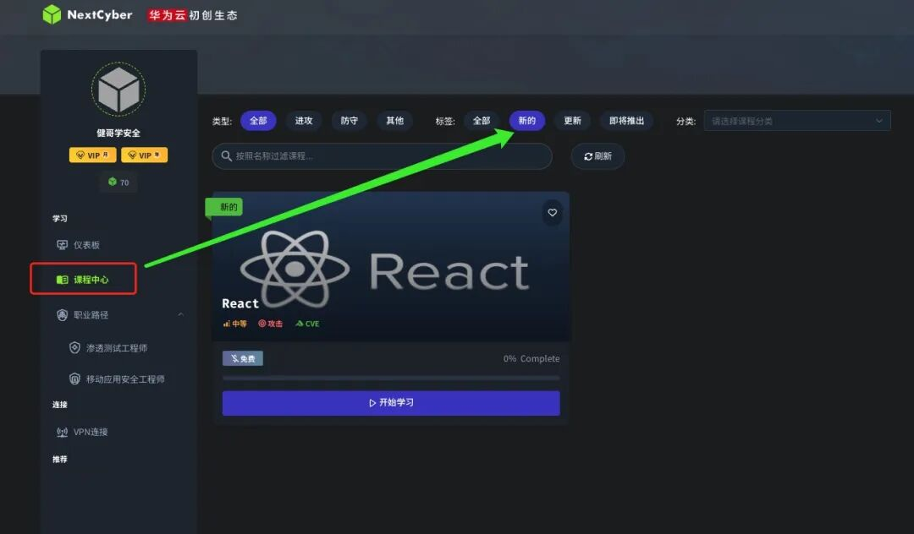
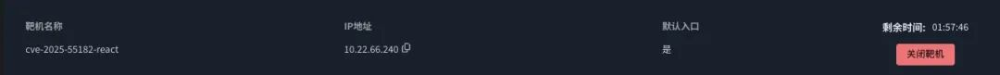

# React Unauthorized Remote Code Execution (CVE-2025-55182)

> [中文文档](README.md)

| Attribute | Details |
|-----------|---------|
| **CVE ID** | CVE-2025-55182 |
| **Affected Versions** | React 19.0/19.1.0/19.1.1/19.2.0 |
| **Vulnerability Type** | Unauthorized Remote Code Execution |
| **Severity** | 🔴 High |

## Vulnerability Overview

React2Shell is an unauthorized Remote Code Execution (RCE) vulnerability related to React Server Components (RSC). Attackers can craft malicious requests to trigger issues in the server-side deserialization/decoding chain, executing arbitrary code under the server process privileges. This vulnerability was disclosed by React officials on 2025-12-03 with an urgent upgrade recommendation.

Affected versions include 19.0/19.1.0/19.1.1/19.2.0; fixed versions include 19.0.1/19.1.2/19.2.1.

Ecosystem Impact: RSC is adopted by multiple frameworks/bundling chains (such as Next.js), so it's common that "applications without explicitly written Server Functions can also be affected."

In-the-Wild Exploitation: CISA has added this vulnerability to the KEV (Known Exploited Vulnerabilities) catalog (announcement date 2025-12-05), indicating clear evidence of in-the-wild exploitation.

## Vulnerability Details

### 1. What are RSC and the Flight Protocol?

Under normal circumstances, frameworks based on React 19 run some components on the server. After rendering, they send the results to the browser in a specific format, allowing the browser to "restore" them into a component tree. During this process, the server needs to encode/serialize objects into a transferable payload, and the browser decodes/deserializes them.

### 2. Where Did the Problem Occur?

React's Flight protocol uses an unsafe object restoration method during deserialization. It allows the "data" sent by the client to contain special markers (such as `$$typeof`, `_owner`, etc.) that can control the prototype of the restored object. Attackers exploit this feature to create a prototype pollution, modifying the JavaScript built-in object prototype to point to a "malicious function constructor."

### 3. How to Escalate from Pollution to Code Execution?

Once the prototype is polluted, whenever the server calls some common functions (such as JSON.parse, template string evaluation, Function constructor, etc.) during subsequent processing, it will inadvertently execute the pre-planted malicious code by the attacker. The classic gadget chain escalates from polluting Object.prototype to executing arbitrary code.

## Images

---

## Practice

Practice this vulnerability online at [NextCyber Academy](https://app.nextcyber.cn/courses/289).

---

> ⚠️ **Disclaimer**: All content in this directory is for learning and research purposes only. Do not use it for illegal activities.
